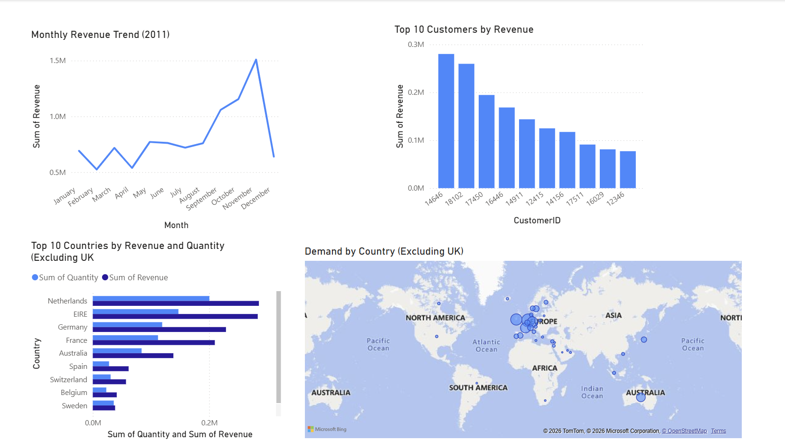

# Tata-Data-visualization-Virtual-Experience
Data analysis and visualization project (Tata Forage) using Power BI to evaluate customer behavior, campaign performance, and business KPIs.

## 📌 Overview
This project is part of the Tata Data Visualization Virtual Experience on Forage. 
It focuses on analyzing retail and customer data to generate actionable business insights.

## 🎯 Objectives
- Analyze customer behavior and sales trends
- Evaluate campaign performance
- Build interactive dashboards for decision-making

## 🛠️ Tools Used
- Power BI
- Excel

## 📊 Dashboard Preview

## 📁 Project Structure
- data/ → Dataset used for analysis  
- dashboard/ → Power BI (.pbix file)  
- images/ → Dashboard screenshots  

## 🚀 Key Insights
- Identified high-value customer segments  
- Improved campaign targeting strategy  
- Highlighted sales and revenue trends  

## 📚 Learnings
- Data visualization  
- KPI tracking  
- Business storytelling  
